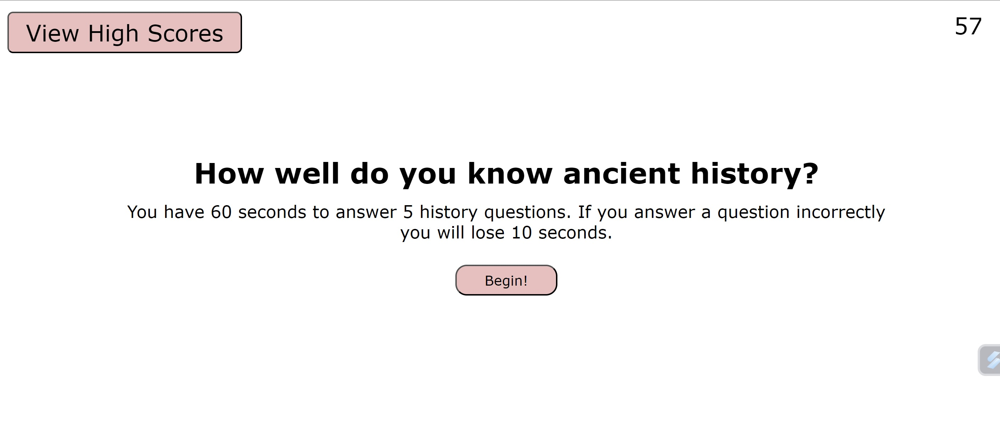

# Module 4 Quiz Project

In this project I created a 5 question quiz from scratch.  It was supposed to have a clean appearance, a timer, and a scorescreen upon completion.

## Installation

N/A
    
## Usage/Examples

https://bradfh.github.io/Ancient-History-Quiz/

Read the instructions and click the Begin! button to start the timer and quiz.  The View Highscores button is clickable but populated from local storage so it will be empty until you enter a value after completing the quiz.

Click the button corresponding to what you think is the correct answer to move on to the next question.

## Lessons Learned

Separation of concerns was the biggest lesson from this assignment.  During a tutoring session the tutor had me split apart many of my functions.  Even though most of them were working it was becoming difficult to add new functionality to the project.  Once I split the functions it was waaaaay easier to add new functions to the script.
## Acknowledgements

https://readme.so

https://www.w3schools.com

Thanks to tutor Scott Everett for once again guiding my through some difficult parts of the coding process.

## License

[MIT](https://choosealicense.com/licenses/mit/)

## Screenshots

